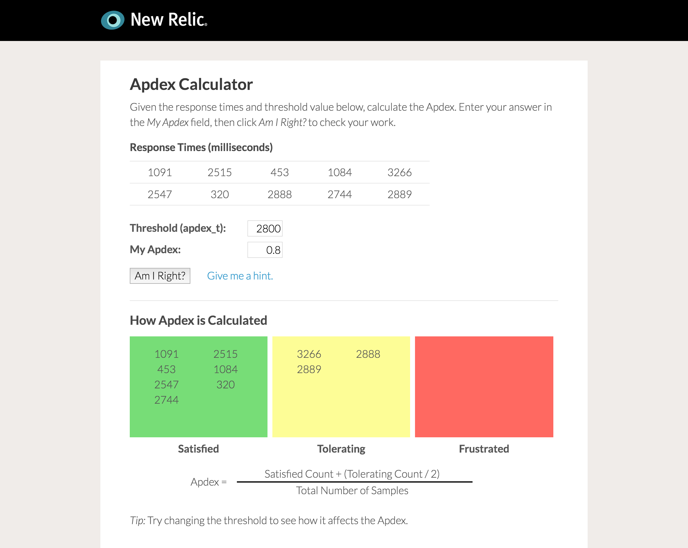

# Apdex Calculator

This Apdex Calculator teaches people how Apdex works by letting them practice calculating the Apdex score of some randomly-generated metrics, and see how changing the Apdex threshold affects the score.

See it in action here: https://newrelicuniversity.github.io/apdex-calculator/

## Usage

Each time the Apdex Calculator loads, it generates 10 random response time values between 100 and 8000; the apdex_t defaults to 1000. Given these metric and threshold values, the user is prompted to calculate the resulting Apdex score. They may enter their answer in the field labeled *My Apdex* and click the *Am I Right?* button to check their work. 

The *Give me a hint* link provides a reminder of how Apdex is calculated, including a breakdown of how the provided metric values fall into the *Satisfied*, *Tolerating*, and *Frustrated* categories.

It is also enlightening to change the apdex_t value and see how it changes the distribution of metrics among *Satisfied*, *Tolerating*, and *Frustrated*. In other words, given this set of metrics, what should the Apdex threshold be in order to get an Apdex score between 0.85 and 0.95?